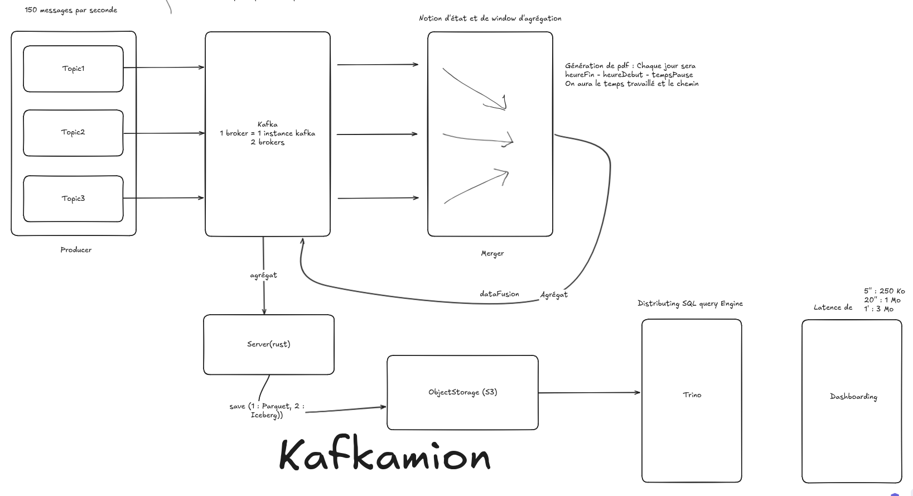

# Kafkamion

## Table of content

1. [Architecture](#architecture)
2. [Topics](#topics)
3. [Topic description](#topic-description)
4. [Agregation](#agregation)
5. [Topic result](#topic-result)

## Architecture



## Topics

1. Entity registration

```json
{
    "type": "string",
    "driver_id": "string",
    "first_name": "string",
    "last_name": "string",
    "email": "string",
    "phone": "string"
}
```

or

```json
{
    "type": "string",
    "truck_id": "string",
    "immatriculation": "string"
}
```

2. Time Registration `time_registration`

```json
{
    "type": "string",
    "timestamp": "string",
    "driver_id": "string",
    "truck_id": "string"
}
```

3. Position

```json
{
    "truck_id": "string",
    "latitude": "number",
    "longitude": "number",
    "timestamp": "string"
}
```

## Topic description

Each Topic is defined as follow :

1. **Topic 1**
The type can be `driver` or `truck` and will be handled differently. The key is the `driver_id` or the `truck_id` and the value is the information of the driver or the truck.

2. **Topic 2**
This topic is used to store the time registration of the driver. The key is the type of the time registration and the value is the timestamp.

3. **Topic 3**
This topic is used to store the position of the driver. The key is the `truck_id` and the value is the position of the driver.

## Agregation

The aggregation is done by the `driver_id` between the first topic and the second. The aggregation is done by the `truck_id` for the second and the third topic.

## Topic result

The result of the merge will be a json flat topic of our three producer topics.

```json
{
    "driver_id": "string",
    "first_name": "string",
    "last_name": "string",
    "email": "string",
    "phone": "string",
    "truck_id": "string",
    "immatriculation": "string",
    "start_time": "string",
    "end_time": "string",
    "rest_time": "string",
    "latitude_start": "number",
    "longitude_start": "number",
    "timestamp_start": "string",
    "latitude_end": "number",
    "longitude_end": "number",
    "timestamp_end": "string",
    "latitude_rest": "number",
    "longitude_rest": "number",
    "timestamp_rest": "string"
}
```